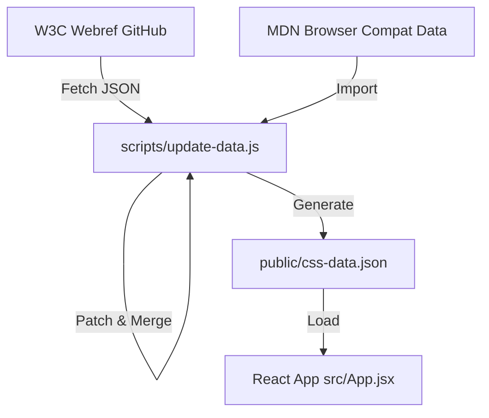
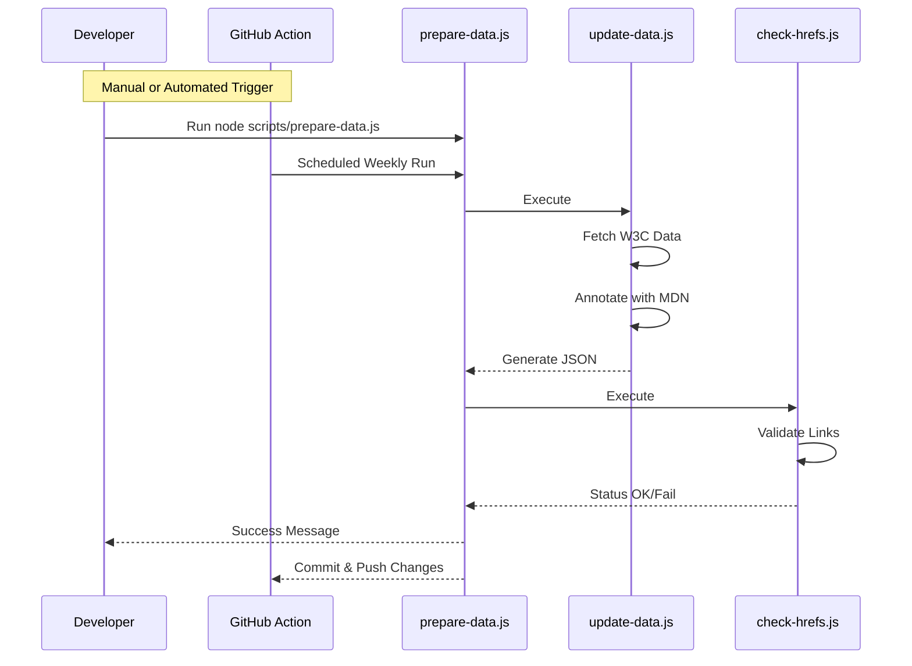

# CSS Viewer Project Explainer

This document outlines the architecture, build process, and data integration strategy for the CSS Viewer application.

## Overview

The CSS Viewer is a React application that serves as a comprehensive reference for CSS properties, values, functions, and at-rules. It distinguishes itself by combining raw specification data from the W3C with practical browser compatibility data from MDN.

## Data Integration Strategy

The application does not fetch data live from external APIs during runtime to ensure performance and reliability. Instead, it uses a **build-time data ingestion pipeline** that generates static JSON files.

### Data Sources

1. **W3C Webref (`w3c/webref`)**:
    * Source: `https://raw.githubusercontent.com/w3c/webref/curated/ed/css/`
    * Purpose: Provides the authoritative definitions, syntax, and links to the official specifications.
    * We fetch the "Editor's Draft" (ED) versions to get the most up-to-date information.

2. **MDN Browser Compatibility Data (`@mdn/browser-compat-data`)**:
    * Source: npm package
    * Purpose: Provides support status for Chrome, Firefox, and Safari.
    * Used to filter "production-ready" features and display support badges.

## Build Process & Scripts

The project relies on custom Node.js scripts located in the `scripts/` directory to manage data.

### 1. `scripts/update-data.js`

**Purpose:** The core data pipeline script. It fetches, aggregates, patches, and enriches CSS data.

**What it does:**

* **Fetches Specs:** Downloads the index of all CSS specifications from W3C.
* **Fetches Definitions:** Iterates through relevant specs to download detailed JSON definitions for properties, values, and at-rules.
* **Patches Data:**
  * Maps `css-color-4` to `css-color` (due to upstream naming conventions).
  * Maps `css-easing-2` to `css-easing`.
  * Injects missing functions like `if()` which are defined in prose but missing from machine-readable data.
  * Fixes missing `href` links for specific items (e.g., `@media`, `display`).
* **Integrates BCD:**
  * Cross-references every item with MDN compatibility data.
  * Adds a `compatibility` object to each item containing support status for Chrome, Firefox, and Safari.
  * Flags items that are only supported behind browser flags.
* **Output:** Generates `public/css-data.json` and `public/specs.json`.

**When to use:**

* Run this whenever you want to update the dataset (e.g., to get new CSS features or updated browser support stats).
* Command: `node scripts/update-data.js`

### 2. `scripts/check-hrefs.js`

**Purpose:** A validation tool to ensure data integrity.

**What it does:**

* Scans the generated `public/css-data.json`.
* Identifies any property, value, or at-rule that is missing a link (`href`) to its specification.
* Reports the specific spec and name of the missing item.

**When to use:**

* Run this after `update-data.js` to verify that the data patching logic is working correctly and that no new broken links have been introduced.
* Command: `node scripts/check-hrefs.js`

### 3. `scripts/prepare-data.js`

**Purpose:** The master orchestration script.

**What it does:**

* Runs `update-data.js` to fetch and process data.
* Runs `check-hrefs.js` to validate the output.
* Ensures the entire pipeline succeeds or fails as a unit.

**When to use:**

* Use this single command to perform a complete data update.
* Command: `node scripts/prepare-data.js`

## Automation

The project includes a GitHub Action workflow (`.github/workflows/weekly-data-update.yml`) that:

1. Runs automatically every Sunday at midnight.
2. Executes `node scripts/prepare-data.js`.
3. Commits and pushes any changes to `public/css-data.json` and `public/specs.json` back to the repository.

## Frontend Integration

The React application (`src/App.jsx`) consumes the static JSON files generated by the scripts.

* **`src/hooks/useCssData.js`**: A custom hook that fetches `css-data.json` and `specs.json` from the `public/` folder. It handles caching (using a timestamp query param) and data flattening.
* **Views**:
  * **Properties**: Shows the raw W3C data, useful for exploring the cutting edge of CSS.
  * **Browser Support**: Filters the data to show only items supported by at least 2 major browsers, using the pre-calculated compatibility data.

## Workflow Summary

1. **Update Data**: `node scripts/prepare-data.js`
2. **Develop/Run**: `npm run dev`
3. **Build App**: `npm run build` (bundles the React app and the static JSON files)
